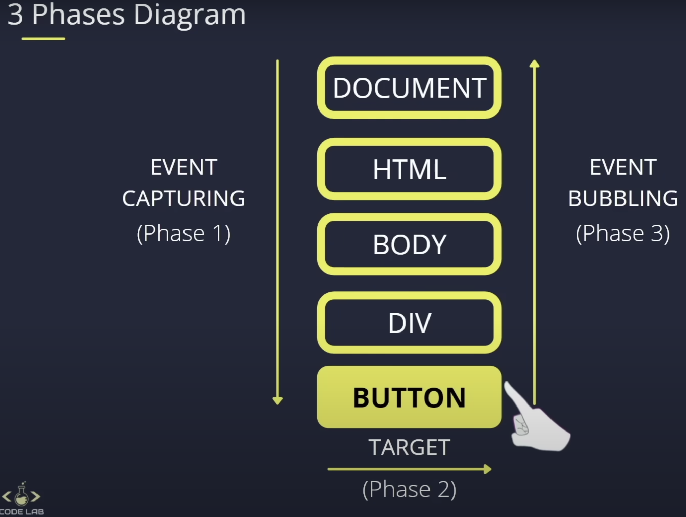

## DOM AND EVENT LISTENER
- creating element: parentElement.append(childElement)
- methods: setAttribute, removeAttribute, classList.add, classList.remove, classList.contains, .remove, firstElementChild, lastElementChild, previousElementSibling, nextElementSibling
- events: click, mouseover, mouseout etc.
- event methods: e.preventDefault(e), e.stopPropagation, target.matches()

Reference: [freeCodeCamp.org](https://www.youtube.com/watch?v=5fb2aPlgoys)