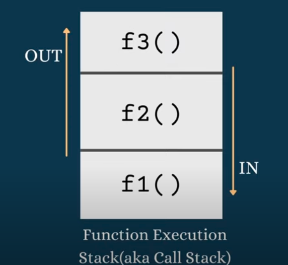
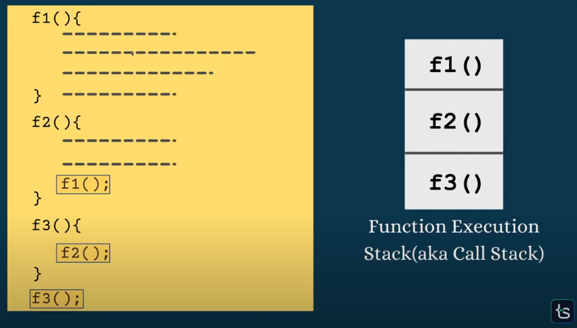

## This is about JS Functions

## Content
- Function Declaration/Defination
(defining the function)

- Function Execution
- Call stack
 
- Arrow functions 
- Nested Functions
-  function scope
- Closure
- Callback function
- Higher oder function (HOF)
- Pure function
- IIFE
- Recursion

## Terminologies used in Functions
- Functions and Methods
- Declaration and Definition
- Arguments and Parameters
- Callback and Higher Order Function

## Reference
- [tapaScript by Tapas Adhikary](https://www.youtube.com/watch?v=UPeFK1uFJCE&t=4415s)