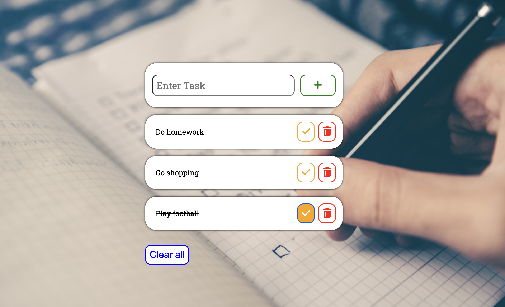

## JS TODO Project
- simple ToDo project where we can add, check,delete, and clear all the tasks.

## Key Concepts for project:
- document.getElementById()
- addEventListener()
- e.target
- appendChild()
- createElement()
- parentElement()
- remove()
- classList.add()